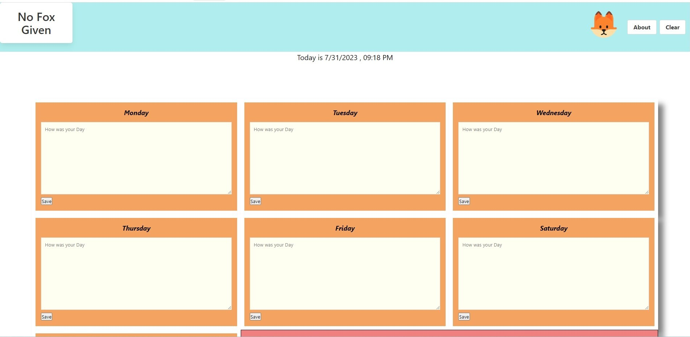
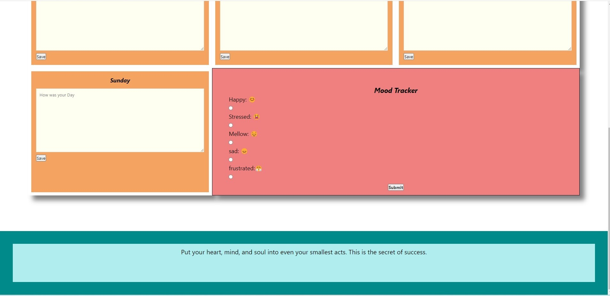

# project1

Daily Journal

# project1

This project is a daily journal application that allows users to write journal entries, track their mood, and receive a random quote. It uses an API to fetch random quotes and displays them to the user after they save their journal entry. Additionally, it includes a mood tracker that visually represents the user's selected mood using emojis for Sad, frustration, happy and mellow.

## Features

Input cards for every day of the week for writing journal entries
Select emojis that represents your mood for the day
Save button to save the journal entry and mood
Random quote API integration to display a quote after saving
Mood tracker to visually represent the selected mood

## User Story

```
As a creative person I would like to keep a record of my daily thoughts, activities and moods, then get a motivational quote and inspirational music after I click save.
```

## Acceptance Criteria

```
Given I am using a daily journal
When I open the journal
Then I am presented with a writing space of each day of the week
When I click into each writing space
Then I can write my thoughts or events
When I click save I am presented with random interesting pictures

```

## Project Mock-Up



